## Overview

**Spark Bytes** is a full-stack web platform built to reduce food waste and combat student food insecurity at Boston University. By connecting campus event organizers with students, the application provides a centralized, secure directory for registering, mapping, and claiming surplus event food.

> **Note:** Spark Bytes addresses campus food waste by replacing fragmented social media alerts with structured reservations and real-time mapping.

---

## Key Features

- **Dual Authentication**: Seamless login options using either traditional email credentials (requiring BUID validation) or Auth0 OAuth.
- **Allergy & Food Filters**: Searchable event index with **18 food categories** and **8 allergen warnings** (e.g., dairy, nuts, wheat).
- **Interactive Geolocation Map**: Leverages Google Maps API to display active food events relative to the student's current location.
- **QR Code Check-ins**: Automatically generates and emails secure, unique QR codes to manage event capacity and prevent duplicate claims.

---

## Technical Architecture

The platform uses a monolithic Django architecture serving server-side rendered templates:

```mermaid
graph TB
    subgraph Client["Client Layer"]
        Browser[Web Browser]
        Templates[Django Templates<br/>HTML/CSS/JS]
    end
    
    subgraph Backend["Backend Layer"]
        Django[Django Framework<br/>Python 3.10<br/>Port 8000]
        Models[Models Layer<br/>Profile & Event]
        Views[Views Layer<br/>Class-Based Views]
        Forms[Forms Layer<br/>Validation]
    end
    
    subgraph Auth["Authentication Layer"]
        Auth0[Auth0 SPA SDK<br/>OAuth 2.0]
        DjangoAuth[Django Auth<br/>Traditional Login]
    end
    
    subgraph Services["External Services"]
        Gmail[Gmail SMTP<br/>Email Service]
        GoogleMaps[Google Maps API<br/>Geolocation]
    end
    
    subgraph Storage["Storage Layer"]
        SQLite[SQLite Database]
        Media[Media Storage<br/>Images & Files]
        Static[Static Files<br/>WhiteNoise]
    end
    
    Browser -->|HTTP Requests| Templates
    Templates -->|Template Rendering| Django
    Django -->|Data Operations| Models
    Django -->|Business Logic| Views
    Views -->|Form Validation| Forms
    Browser -->|OAuth Flow| Auth0
    Auth0 -->|User Info| Django
    Views -->|Email Sending| Gmail
    Templates -->|Map Rendering| GoogleMaps
    Models -->|Persistence| SQLite
    Views -->|File Uploads| Media
    Django -->|Static Assets| Static
    
    style Django fill:#092e20,stroke:#333,stroke-width:1px
    style Auth0 fill:#eb5424,stroke:#333,stroke-width:1px
    style GoogleMaps fill:#4285f4,stroke:#333,stroke-width:1px
    style SQLite fill:#003b57,stroke:#333,stroke-width:1px
```

### Core Technologies
- **Backend Framework**: Django 3.2 (Python 3.10) with Class-Based Views for modular business logic.
- **Assets & Media**: Serving static assets via WhiteNoise and local media storage for event images.
- **Integrations**: Google Maps JS API (markers & geo-routing) and Gmail SMTP (sending reservation QR codes).

---

## Key Achievements

- **Contactless Validation**: Deployed a stateless QR validation service reducing student check-in times to under 3 seconds.
- **Robust Capacity Control**: Implemented database-level constraints on event reservation capacities to eliminate over-booking issues.
- **Responsive Layouts**: Designed a clean custom CSS grid to support seamless usage on mobile browsers during campus events.

---

## Project Links

- **GitHub Repository**: [Spark Bytes](https://github.com/Shangmin-Chen/Spark-Bytes)
- **Presentation Deck**: [Google Slides Presentation](https://docs.google.com/presentation/d/1WUJ4NKX85KHb8Ybb-ZKkAWRyvcUgOTfjAsP78a053Vw/edit)
