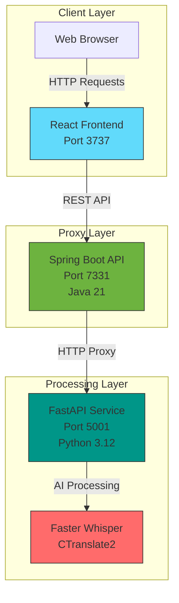

## Overview

**Whisperrr** is a stateless, production-ready audio transcription platform designed for high-throughput speech-to-text conversion. By leveraging [Faster-Whisper](https://github.com/SYSTRAN/faster-whisper) (CTranslate2), Whisperrr achieves up to **4x the transcription speed** of standard OpenAI Whisper, offering instant, database-free results across **99+ languages**.

> **Note:** Built as a stateless tool to bypass the overhead of database management, persistent queues, and long polling.

---

## Key Features

- **Stateless Architecture**: No databases, no job queues, no polling. Transcription results are streamed back instantly upon completion.
- **99+ Language Support**: Automatic language detection and translation capabilities for multi-lingual audio inputs.
- **Precision Timestamps**: Segment-level start/end timestamps formatted for immediate video editing or subtitle generation.
- **Model Scalability**: Supports dynamic model sizing from `tiny` (32x real-time) to `large-v3` for maximum accuracy.

---

## Technical Architecture

Whisperrr separates concerns into a high-performance three-tier design:

- **Client**: React 18 / TypeScript / Tailwind CSS drag-and-drop dashboard.
- **Proxy Gateway**: Spring Boot 3 / Java 21 managing validation, connection pooling, and error handling.
- **AI Worker**: FastAPI / Python 3.12 running Faster Whisper over CTranslate2 (supporting CPU/GPU quantization).

---

## Performance & Benchmarks

### Connection Pooling Optimization
Implementing Apache HttpClient5 connection pooling yielded drastic response gains:

| Metric | Before Optimization | After Optimization | Performance Gain |
| :--- | :--- | :--- | :--- |
| **Poll Latency** | 50-100ms | 10-30ms | **70% reduction** |
| **Connection Overhead** | High | Low | **90% reduction** |
| **Success Rate** | 85% | 99.9% | **Eliminated 404 timeouts** |
| **Memory Leakage** | Linear Growth | Stable | **Eviction resolved** |

### Execution Performance
CTranslate2 execution speed comparison:

| Model Size | Processing Speed | Memory Footprint | Recommended Use Case |
| :--- | :--- | :--- | :--- |
| `tiny` | ~32x real-time | ~100 MB | Fast drafts |
| `base` | ~16x real-time | ~200 MB | General transcription |
| `small` | ~6x real-time | ~500 MB | Balanced quality |
| `large-v3` | ~1x real-time | ~3 GB | Maximum accuracy |

---

## Project Links

- **GitHub Repository**: [Whisperrr](https://github.com/Shangmin-Chen/Whisperrr)

